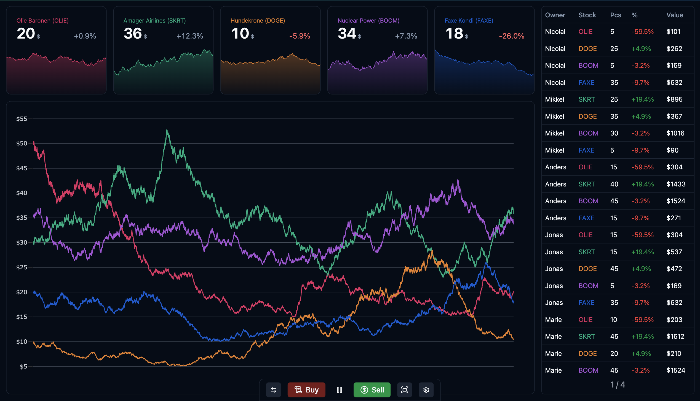

# FAKE STOCKS

[Live version](https://stocks.grymse.dk)

- This interface allows you to simulate a fake stock market over an evening
- People buy/sell stocks using an external currency
- The interface will display the stock changes

### The app after running 1h45m

# Technologies

- ReactJS
- Shadcn UI + Tailwind
- ReChart
- Plotly.js

# HOW TO START

- Ensure you have node 16+
- Download repo
- In fake-stock-market folder run
  - `npm install`
  - `npm run dev`
- Open the link `http://localhost:????/` displayed :D
- Click start on the interface, and start buying/selling stocks using the button

# Credits

Created solely by Busta Grymes
